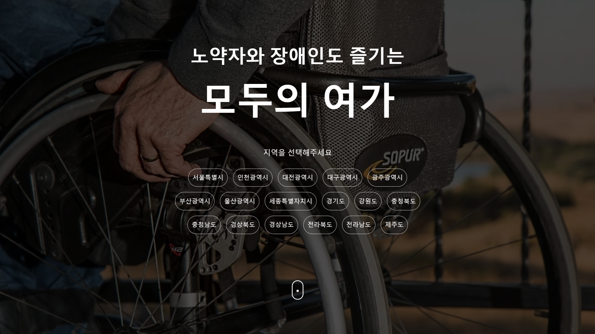
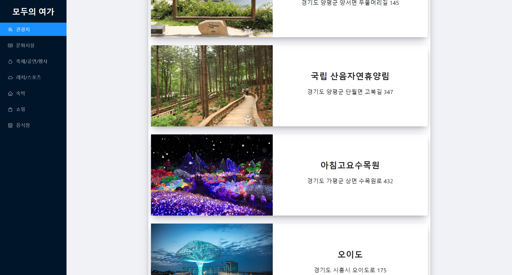
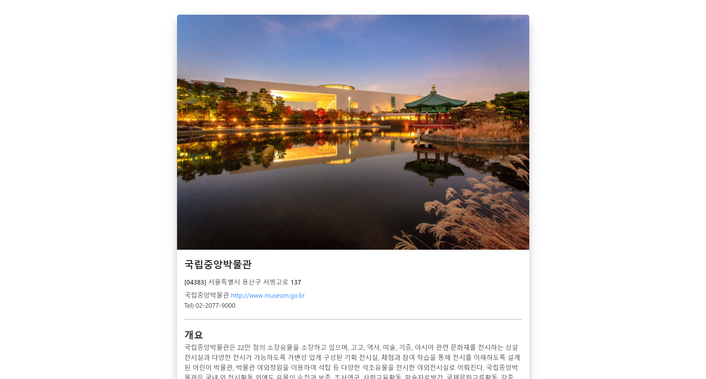
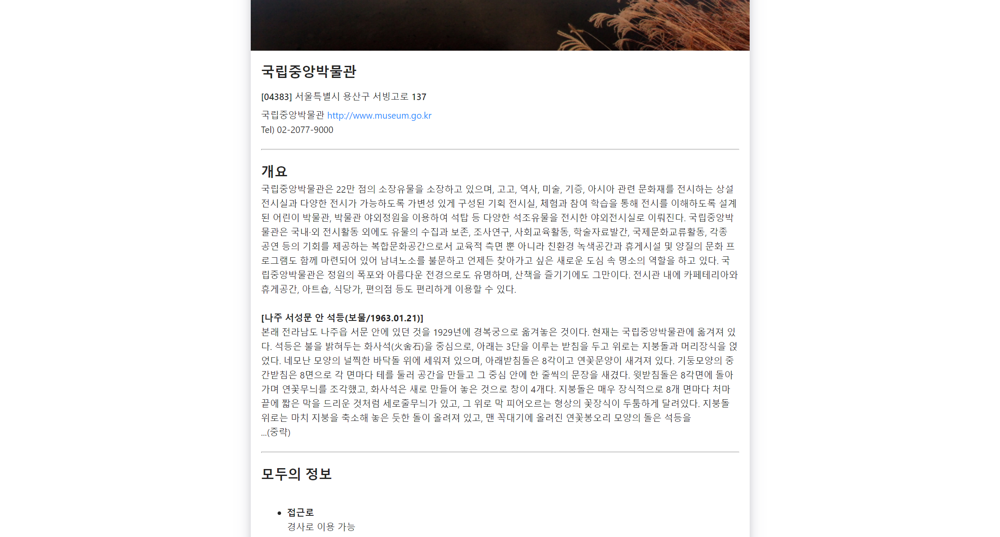
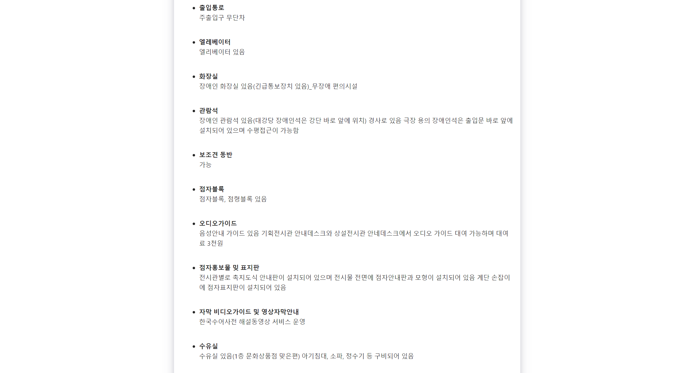
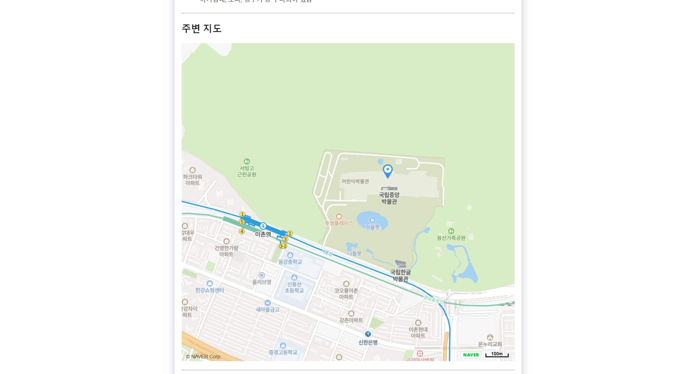
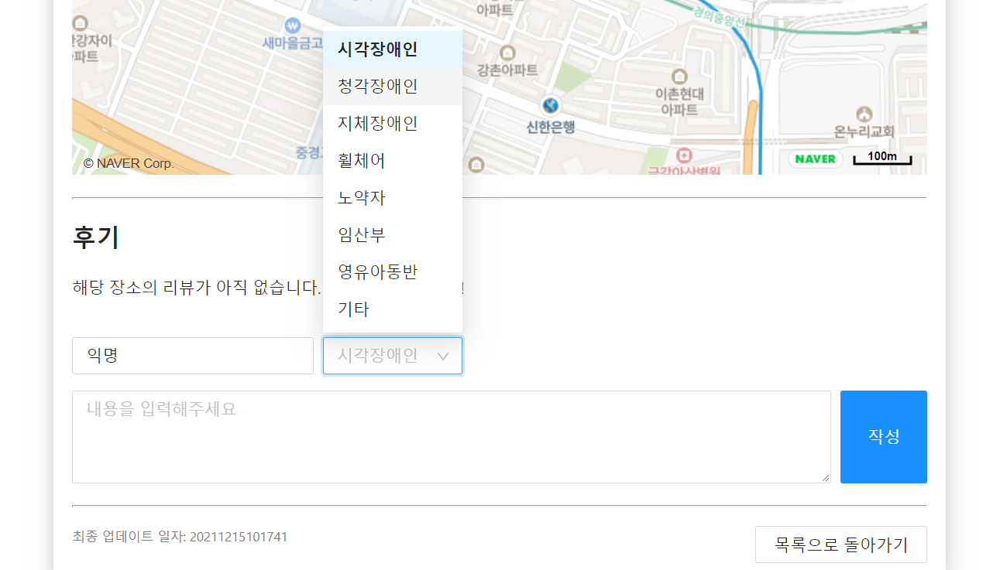

# 모두의 여가

본 웹페이지는 한국관광공사에서 제공하는 Open API 를 통해
지역별 각종 여가 장소의 장애 시설 관련 정보를 제공합니다.
장소 유형에 따른 분류 기능을 제공하고 있으며 장애 관련 정보 뿐만 아니라
장소에 대한 주소, 설명, 지도 등 다양한 기본 정보들도 제공합니다.
그리고 장소별 후기 시스템을 통해 다양한 사람들의 장애별 방문 후기를 접할 수 있습니다.
그동안 자신이 갖고 있는 제약사항 때문에 여가를 즐기기 망설이셨나요?
이제 모두의 여가를 통해 다양한 장소들을 살펴보며 마음껏 즐겨보세요!😁

 

# 서비스

## 지역 및 카테고리 별 관광지

지역 및 카테고리 별로 다양한 관광지를 한 눈에 쉽게 볼 수 있습니다.

## 상세 관광지 정보

### 기본 정보 및 이미지

### 관광지 개요

### 무장애 정보

### 주변 지도

### 장애별 후기 공유

 

# 기술

## 프론트엔드

- `React`
- `SCSS`
- `HTML` / `Javascript`

## 서버 및 DB

- `Firebase Database`

## API

- `Tour API`
- `Naver Map API`

## 배포

- `Google Cloud Platform`

 

# 소개 영상

[유튜브 링크](https://youtu.be/clJt-OhWHOI)